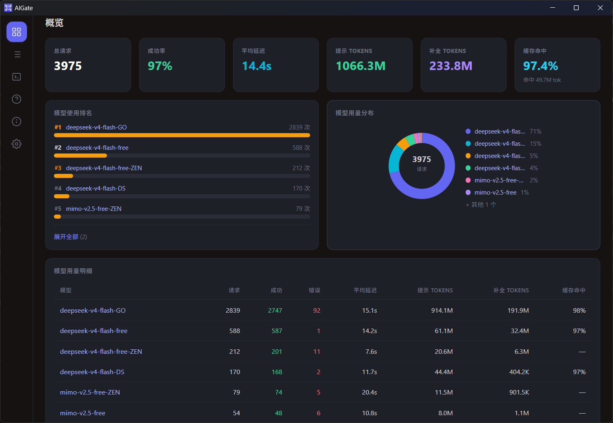
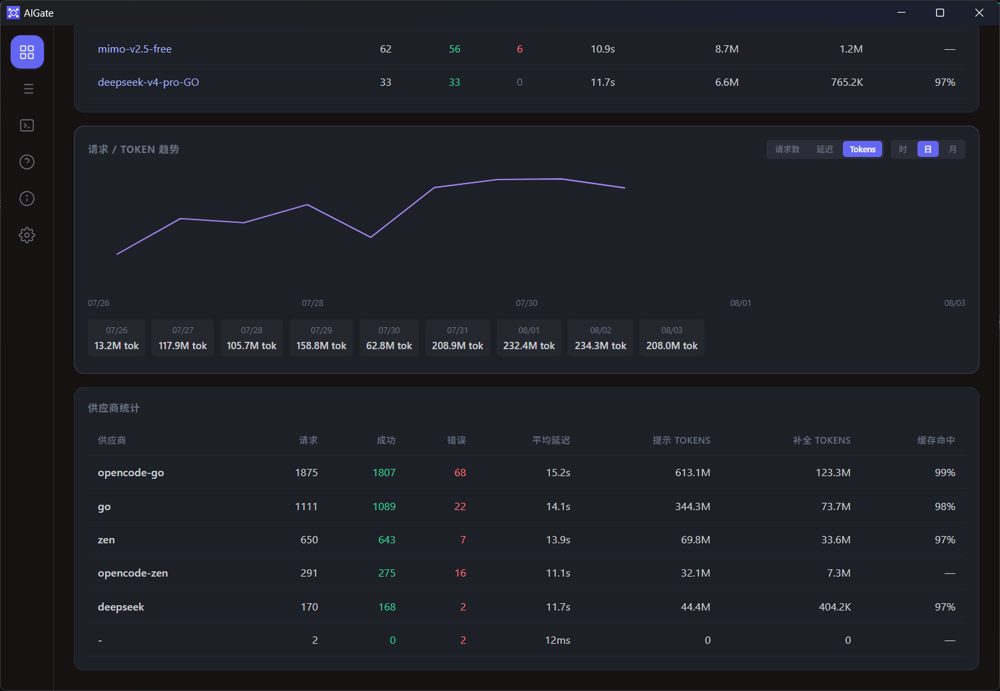

# AIGate

[](LICENSE)

[](https://github.com/wonderfulaichen/AIGate/releases)

**AIGate** 是一个本地 OpenAI 兼容反向代理，提供多供应商路由、模型名映射、参数注入、成本核算与实时监控面板等功能，并以桌面应用形式交付（原生窗口 + 系统托盘 + 后台运行）。

**核心价值**：统一管理多个 AI 供应商的 API 端点，通过一套 OpenAI 兼容接口对外暴露，同时提供可视化监控和管理能力。

---

## 目录

- [功能特性](#功能特性)
- [界面预览](#界面预览)
- [系统要求](#系统要求)
  - [从源码构建](#从源码构建)
- [配置指南](#配置指南)
  - [providers.json](#providersjson)
  - [.env 环境变量](#env-环境变量)
  - [供应商路由规则](#供应商路由规则)
  - [参数注入](#参数注入)
  - [热重载](#热重载)
  - [熔断保护（Circuit Breaker）](#熔断保护circuit-breaker)
  - [管理面板 API 鉴权](#管理面板-api-鉴权)
- [客户端配置](#客户端配置)
  - [Model ID 列表](#model-id-列表)
- [管理面板](#管理面板)
  - [侧边栏导航](#侧边栏导航)
- [更新日志](#更新日志)
- [API 参考](#api-参考)
- [项目结构](#项目结构)
  - [模块依赖](#模块依赖)
- [常见问题](#常见问题)
- [许可](#许可)

---

## 功能特性

### 核心代理

- **多供应商路由** — 在 `providers.json` 中配置任意多个上游 API，根据模型 ID 自动路由到对应端点
- **三协议支持** — 对外同时提供 OpenAI `/v1/chat/completions`、Anthropic `/v1/messages`、OpenAI Responses `/v1/responses` 三个入口；上游协议可按「模型级 → 供应商级 → 模型名推断」三层回落解析，网关自动做双向格式转换（Responses 上游同协议时**原生直通**，请求/响应字节级透传）
- **模型名映射** — 客户端使用「模型中转ID」（形如 `供应商/上游模型ID`），网关自动替换为上游真实模型名
- **参数注入** — 对指定模型自动注入 `reasoning_effort`（思考强度）、`extra_body`（额外字段），不覆盖客户端已有值
- **转发优化（省 token）** — 历史推理链瘦身、带工具调用的推理链按**协议白名单**剥离、长会话历史裁剪、响应缓存（实验功能），各项省量可在分析页「省量审计」核查
- **成本核算** — 模型单价可编辑（支持高峰/空闲双价与 Anthropic 缓存写入价），价格快照随请求冻结（改价不改写历史账单），KV 缓存命中/写入按各自档位计价
- **友好错误提示** — 上游错误响应自动解析并翻译为中文说明（如 `invalid_request_error` → 请求参数错误），管理面板日志更易读
- **API Key 管理** — 每个供应商可独立配置 API Key，通过环境变量注入，面板内可视化编辑
- **IPv4 强制解析** — 自定义 DNS 解析器过滤 IPv6 地址，避免 IPv6 不通导致连接失败
- **SSE 流式透传** — 完整支持 Server-Sent Events 流式响应，逐块转发不缓冲
- **断流自动续写** — 上游中途断流且无 `finish_reason` 时，自动带已输出内容重发「继续」并把新响应拼进当前流
- **Token 用量解析** — 从上游响应中解析 `usage` 字段，统计 prompt / completion token 数；上游未上报时标记为**估算值**（面板以 `≈` 区分，不把猜测当实测展示）
- **死循环检测** — 流式检测重复内容并截断，避免模型陷入重复输出白烧 token
- **熔断保护** — 按供应商维度的熔断器；连续失败或错误率超阈值后断开（快速返回 503），超时后自动探测恢复；面板「重置熔断」可手动恢复
- **管理面板鉴权** — 可选 Bearer 令牌保护管理 API（设置 `AIGATE_ADMIN_TOKEN` 后生效）

### 桌面应用

- **原生窗口** — 基于 `winit` + `wry` 的内嵌 WebView，无需浏览器即可使用管理面板
- **系统托盘** — 最小化到托盘后台运行，双击托盘图标恢复窗口
- **托盘菜单** — 右键托盘图标显示菜单：打开面板 / 退出
- **自启动配置** — 首次运行自动生成 `providers.json` 和 `.env`

### 监控面板

- **实时请求日志** — 请求流水（模型、供应商、协议、状态码、延迟、Token 用量），支持分页、检索与单条详情
- **概览页** — 统计卡片（请求 / Token / 费用 / 成功率 / 缓存命中率 / 生成速度）+ 模型用量排名 + 占比环 + Token 趋势图
- **分析页** — 五张 KPI 卡 + Token 趋势图（悬停十字线与数值浮层）+ **省量审计**（已生效省量按来源拆分、KV 缓存命中率、潜在可省量，各项带折算费用与口径披露）+ 调用分布 + 调用排名 + 模型明细 + 供应商性能 + 余额查询
- **趋势图表** — 支持小时 / 日 / 月三个粒度，含请求数、token 量、费用、延迟等维度，多模型序列与占比图例；自动裁掉首尾无数据的空桶
- **费用与省量** — 记录详情显示「本次费用」「KV 缓存净省」与四类优化省量拆分；费用由后端下发，与统计页同口径
- **代理状态** — 设置页「代理服务」卡片可视化显示当前代理模式（系统 / 禁用 / 自定义）及地址
- **供应商管理** — 查看与编辑所有供应商配置（名称可编辑，重命名自动迁移 API Key），支持连接测试与从上游拉取模型列表
- **模型表格** — 逐模型编辑中转ID / 上游模型名 / 思考强度 / 协议 / 单价，支持批量应用价格与 CSV 导入导出
- **API Key 管理** — 可视化编辑各供应商的 API Key，实时生效
- **更新亮点弹窗** — 版本升级后首次打开自动弹出最新更新日志，标记已读后不再弹出
- **日志导出** — 将请求日志导出为 JSON 文件

### 余额查询与计费配置

- **余额查询**：管理面板「分析」页展示各供应商余额，支持 API 自动查询与手动设置（手动值持久化于 `config/balance.json`，优先于 API）。需在 `providers.json` 对应供应商配置 `balance_endpoint`；已知示例：DeepSeek `https://api.deepseek.com/user/balance`。其他供应商（SiliconFlow / OpenRouter / Moonshot 等）请查阅其官方文档填入对应 URL；无公开余额 API 的供应商使用「手动设置」即可。
- **计费配置**：在 `providers.json` 模型条目加 `"price": { "input_per_m": ..., "output_per_m": ..., "cache_read_per_m": ..., "cache_creation_per_m": ... }` 可自定义单价（元 / 百万 tokens）。`cache_creation_per_m` 为缓存**首次写入**价（Anthropic 等写入缓存独立计费），可选，缺失时回退输入价。`providers.json` 为严格 JSON，请勿写入注释。

---

## 界面预览



AIGate 管理面板「概览」页：实时展示总请求量、成功率、平均延迟、输入 / 输出 Tokens、**缓存命中率**，以及模型使用排名与用量分布。



「请求 / Token 趋势」与「供应商统计」：按日/时/月维度展示 Token 用量走势，并按供应商汇总请求量、成功率、延迟与缓存命中率（编程软件每轮请求前缀高度重复，长前缀场景下 KV 缓存命中率可达 90%+ 甚至更高，具体以您面板实际数字为准）。

> 提示：面板提供「概览 / 分析 / 记录 / 供应商 / 设置 / 关于」六个页面，全部通过内嵌 WebView 或浏览器访问 `http://127.0.0.1:8787/admin` 即可使用。

---

## 系统要求

| 平台 | 支持情况 |
|------|---------|
| Windows 10/11 | ✅ 原生支持 |
| macOS | 需自行构建 |
| Linux (X11/Wayland) | 需自行构建 |

运行时依赖：

- Windows: 无需额外运行时（已静态链接）
- 其他平台: 需安装 WebKit2GTK（`wry` 依赖）

### 从源码构建

构建环境：

- Rust 1.75+
- Windows: 仅需 Visual Studio Build Tools（`rust-mscv` 工具链）
- Linux: `sudo apt install libwebkit2gtk-4.1-dev libgtk-3-dev libayatana-appindicator3-dev`

```bash
git clone https://github.com/wonderfulaichen/AIGate.git
cd AIGate
cargo build --release
```

构建产物在 `target/release/AIGate.exe`（Windows）或 `target/release/aigate`（其他平台）。

---

## 配置指南

### providers.json

`providers.json` 定义所有上游供应商及其模型映射，首次启动时自动生成示例配置。

#### 完整结构

```json
{
  "_说明": "供应商配置文件",
  "providers": [
    {
      "name": "供应商名称",
      "endpoint": "https://你的端点/v1/chat/completions",
      "api_key_env": "环境变量名",
      "api_key_default": "默认值（可选）",
      "headers": {
        "额外请求头": "值"
      },
      "models": {
        "客户端模型ID": {
          "upstream_model": "上游真实模型名",
          "reasoning_effort": "low|medium|high|max",
          "extra_body": {
            "额外字段": "值"
          }
        }
      }
    }
  ]
}
```

#### 字段说明

| 字段 | 类型 | 必填 | 说明 |
|------|------|------|------|
| `name` | string | 是 | 供应商标识，仅用于日志显示 |
| `endpoint` | string | 是 | 上游 chat/completions 完整 URL |
| `api_key_env` | string | 是 | 读取 API Key 的环境变量名，对应 `.env` 中的 key |
| `api_key_default` | string | 否 | 环境变量未设置时的默认值（如 `public`） |
| `headers` | object | 否 | 额外注入的 HTTP 请求头（键值对） |
| `models` | object | 是 | 模型映射表，key 是客户端使用的**模型中转ID**（可任取符合用途的名称；`upstream_model` 才是上游真实模型名） |

每个模型的配置：

| 字段 | 类型 | 必填 | 说明 |
|------|------|------|------|
| `upstream_model` | string | 是 | 转发时替换 `model` 字段为上游真实模型名 |
| `api_format` | string | 否 | 上游协议：省略 / `openai`（默认，`/chat/completions`）、`anthropic`（`/messages`）、`responses`（`/responses`） |
| `reasoning_effort` | string | 否 | 思考强度：`low` / `medium` / `high` / `max` |
| `extra_body` | object | 否 | 额外注入的请求体字段（任意 JSON） |
| `price` | object | 否 | 单价（元/百万 tokens）：`input_per_m` / `output_per_m` / `cache_read_per_m` / `cache_creation_per_m`，另可配 `*_offpeak` 高峰/空闲双价 |
| `strip_toolcall_reasoning` | bool | 否 | 逐模型覆盖「带工具调用的推理链」是否剥离（优先于设置页的协议白名单） |

#### 模型中转ID 命名规范

客户端在请求 `model` 字段里填的是**模型中转ID**（对外暴露的别名），由你在 `models` 的 key 中自由定义；网关会把它替换为 `upstream_model` 再转发。推荐命名：

```
<供应商名>/<上游模型ID>
```

例如：

| 模型中转ID | 上游真实模型 |
|---------|------|
| `go/kimi-k2.7-code` | `kimi-k2.7-code`（Go 套餐） |
| `deepseek/deepseek-v4-flash` | `deepseek-v4-flash`（DeepSeek 官方） |
| `commandcodeAI/deepseek/deepseek-v4-flash` | `deepseek/deepseek-v4-flash`（上游本身用「作者/模型」命名时，前缀照加） |

> ⚠️ **不要在不同供应商下使用同一个中转ID**。路由表按中转ID 索引，一个 ID 只能有一条路由——**后配置的供应商会静默覆盖前者**，被覆盖那条改了协议 / 思考强度 / 单价都不会生效。从面板「拉取模型」自动生成的 ID 已带供应商前缀，不会撞车；手工编辑时请保持该形式。若保存时检测到重复，模型表格会在该 ID 下方给出橙色警示并指名冲突的另一方（**只提示，不阻断保存**）。

#### 示例

```json
{
  "providers": [
    {
      "name": "deepseek",
      "endpoint": "https://api.deepseek.com/v1/chat/completions",
      "api_key_env": "DEEPSEEK_API_KEY",
      "models": {
        "deepseek-v4-flash-DS": {
          "upstream_model": "deepseek-v4-flash",
          "reasoning_effort": "max"
        },
        "deepseek-v4-pro-DS": {
          "upstream_model": "deepseek-v4-pro",
          "reasoning_effort": "max"
        }
      }
    }
  ]
}
```

### .env 环境变量

```
PORT=8787                    # 监听端口，默认 8787
RUST_LOG=info                # 日志级别（info / debug / warn / error）
CONNECT_TIMEOUT=10           # 连接超时（秒），仅限制建连阶段，默认 10
REQUEST_TIMEOUT_SECS=660      # 整体请求超时（秒），含等待与读取流式响应，默认 660
STREAM_IDLE_TIMEOUT_SECS=120  # 流式响应空闲超时（秒），上游超时不吐块则断开，默认 120
RETRY_MAX=1                  # 瞬态失败重试次数（连接/超时错误与 5xx），默认 1
RETRY_BACKOFF_MS=200         # 重试退避基数（毫秒），默认 200
AIGATE_ADMIN_TOKEN=          # 管理面板 API 鉴权令牌（留空则不鉴权）
AIGATE_DATA_DIR=             # 数据目录（日志 / 日级账本 / keys），默认 exe 同级 data/

# 转发优化（设置页可运行时热切换，此处为启动默认值）
STRIP_HISTORY_REASONING=1          # 历史推理链瘦身，默认 1（开）
STRIP_TOOLCALL_ON_CHAT=1           # 按协议剥离工具轮次推理链：Chat 协议，默认 1（开）
STRIP_TOOLCALL_ON_RESPONSES=0      # 同上：Responses 协议，默认 0（关，未实测安全）
MAX_HISTORY_TURNS=0                # 长会话历史裁剪：仅保留最近 N 条 user 轮，0 = 不裁剪
AIGATE_AUTO_CONTINUE=2             # 断流自动续写次数上限，默认 2，0 = 关闭

# 响应缓存（实验功能）
CACHE_ENABLED=0              # 是否启用，默认 0（关）
CACHE_TTL_SECS=300           # 缓存有效期（秒），默认 300
CACHE_MAX_ENTRIES=1024       # 缓存条目上限，默认 1024

# 死循环检测
LOOP_GUARD_ENABLED=1         # 是否启用，默认 1（开）
LOOP_GUARD_WINDOW=512        # 检测窗口（字符数）
LOOP_GUARD_MIN_REPEAT=8      # 连续重复最小次数
LOOP_GUARD_MAX_BUFFER=8192   # 环形缓冲上限（字符数）

# 熔断
BREAKER_FAILURE_THRESHOLD=4  # 熔断：连续失败次数阈值，默认 4
BREAKER_SUCCESS_THRESHOLD=2  # 熔断：HalfOpen 连续成功次数阈值，默认 2
BREAKER_TIMEOUT_SECS=60      # 熔断：Open 状态维持秒数，默认 60
BREAKER_ERROR_RATE=0.6       # 熔断：错误率阈值（需样本数 >= min_requests），默认 0.6
BREAKER_MIN_REQUESTS=10      # 熔断：触发错误率判定所需最小样本数，默认 10

# 上游 API Key（变量名须与 providers.json 的 api_key_env 一致）
OPENCODE_ZEN_KEY=public      # Zen 套餐 API Key（免费模型用 public）
OPENCODE_GO_KEY=             # Go 套餐 API Key（留空则不配置）
DEEPSEEK_API_KEY=            # DeepSeek 官方 API Key

# 其他
AIGATE_LANG=                 # 界面语言（zh-CN / en-US）；优先级：本变量 > 面板内已保存设置 > 默认中文
AIGATE_NO_PROXY=             # 设为 1/true/yes/on 则完全禁用上游代理
AIGATE_PROXY=                # 自定义上游代理地址（如 http://127.0.0.1:7890），覆盖系统代理
CACHE_PERSIST=               # 响应缓存落盘路径；⚠️ 落盘体含对话明文，启用即接受本地落盘风险
AIGATE_FORCE_HTTP1=          # 设为 1 强制 HTTP/1.1（排查上游 HTTP/2 兼容问题时用）
```

> 环境变量名对应 `providers.json` 中 `api_key_env` 字段值。如需新增供应商，在 `.env` 中添加对应变量即可。
>
> 熔断阈值（`BREAKER_*`）、超时（`CONNECT_TIMEOUT` / `REQUEST_TIMEOUT_SECS` / `STREAM_IDLE_TIMEOUT_SECS`）、重试（`RETRY_*`）、`AIGATE_ADMIN_TOKEN`、`AIGATE_DATA_DIR` 仅在**启动时**读取，修改后需重启生效。转发优化与缓存各项可在设置页**热切换**（重启回到此处默认值）。

> 请求日志持久化文件 `data/logs.jsonl` 超过 2MB 时自动滚动，仅保留最近 5000 条。

### 供应商路由规则

请求处理流程：

1. 客户端发送 `POST /v1/chat/completions`（或 `/v1/messages`、`/v1/responses`），body 中包含 `model` 字段
2. AIGate 按中转ID 查路由表（`/v1/messages` 与 `/v1/responses` 会先转换为 chat 规范再走同一管线）
3. 找到后：解析上游协议（模型级 → 供应商级 → 模型名推断）→ 替换 `model` 为 `upstream_model` → 注入 `reasoning_effort` / `extra_body` → 转发优化（剥离推理链 / 历史裁剪）→ 设置 `Authorization` 请求头
4. 转发到对应端点（协议为 anthropic / responses 时改写为对应路径）
5. 流式或非流式透传上游响应（必要时译回客户端协议），同时解析 `usage` 字段记录 token 用量与费用

匹配规则：**精确匹配**，客户端传的模型 ID 必须与 `models` 的 key 完全一致。

### 参数注入

**reasoning_effort**：对支持推理的模型，在请求 body 中注入 `reasoning_effort` 字段。如果客户端已携带该字段则不覆盖。

**extra_body**：在请求 body 中注入任意额外字段，可用于传递供应商特有参数。如果客户端已携带同名键则不覆盖。

### 热重载

编辑 `providers.json` 后**无需重启**实例——系统检测到文件变化后会自动重新加载路由表。

### 熔断保护（Circuit Breaker）

为每个供应商维护独立的熔断器，避免把请求持续打向已挂的上游、也避免苦等 660s 超时：

- **触发断开（Open）**：某供应商在滚动窗口内「连续失败达 `BREAKER_FAILURE_THRESHOLD` 次」**或**「样本数 ≥ `BREAKER_MIN_REQUESTS` 且错误率 ≥ `BREAKER_ERROR_RATE`」即断开。
- **失败判定**：网络错误 + 上游 5xx 记失败；4xx（含 429 限流）视为供应商仍健康，记成功、不熔断。
- **自动恢复**：Open 维持 `BREAKER_TIMEOUT_SECS` 秒后转入 HalfOpen，放行单个探测请求；探测成功连续达 `BREAKER_SUCCESS_THRESHOLD` 次则恢复（Closed），失败则重新断开。
- **启动预检**：启动时复用 reqwest 客户端（与真实转发请求同网络路径，含 IPv4 解析与代理）对每个供应商的 `/models` 端点做 HTTP 连通性探测，连接层失败（DNS/连接被拒/超时）者直接预置为 Open，使其快速失败（503）而非干等。
- **手动重置**：管理面板「供应商」页的供应商卡片上提供「重置熔断」按钮，立即恢复 Closed。

熔断状态可在管理面板「供应商」页实时查看（`closed` / `open` / `half-open`，对应绿/红/黄）。

### 管理面板 API 鉴权

管理 API（`/admin/api/*`）默认不鉴权，便于本机直接使用。

如需防止同机其它进程或局域网访问，设置环境变量 `AIGATE_ADMIN_TOKEN` 后，所有 `/admin/api/*` 请求必须携带 `Authorization: Bearer <令牌>`，否则返回 401。本地桌面窗口（WebView）会自动注入该令牌，面板功能不受影响；外部调用方需自行在请求头中带上令牌。

> 令牌仅经环境变量注入，不写入代码或配置文件，符合密钥管理规范。

---

## 客户端配置

在任何 OpenAI 兼容的客户端中：

```
API 地址: http://127.0.0.1:8787/v1/chat/completions
API Key:  任意值（实际使用 .env 中配置的 key）
模型 ID:  见 providers.json 的 models 映射表 key（即「模型中转ID」，如 go/deepseek-v4-flash）
```

### Model ID 列表

也可以通过 API 获取可用模型列表：

```bash
curl http://127.0.0.1:8787/v1/models
```

返回 OpenAI 兼容格式的模型列表。

---

## 管理面板

启动后默认自动打开管理面板（桌面窗口），也可在浏览器访问 `http://127.0.0.1:8787/admin`（桌面窗口内嵌 WebView 加载同一页面）。

### 侧边栏导航

管理面板采用左侧边栏导航，分为 **概览 / 分析 / 记录 / 供应商 / 设置 / 关于** 六个页面（关于置底）：

| 页面 | 内容 |
|------|------|
| 概览 | 统计卡片（请求 / Token / 费用 / 成功率 / 缓存命中率 / 生成速度）+ 模型用量排名 + 占比环 + Token 趋势图 |
| 分析 | 五张 KPI 卡 + Token 趋势图（悬停十字线 + 数值浮层）+ 省量审计 + 调用分布 + 调用排名 + 模型明细 + 供应商性能 + 余额查询 |
| 记录 | 请求流水（时间、模型、供应商、协议、状态码、延迟、Token 用量、费用），支持分页、检索、单条详情与 JSON 导出 |
| 供应商 | 供应商列表与编辑抽屉（连接测试、从上游拉取模型、模型表格里逐模型配置中转ID / 上游模型名 / 思考强度 / 协议 / 单价、API Key 管理）。熔断状态与「重置熔断」也在供应商卡片上 |
| 设置 | 性能与优化（历史推理链瘦身、工具轮次推理链剥离按协议、长会话历史裁剪、断流自动续写、连接参数）、响应缓存（实验功能）、个性化（界面语言、显示币种）、分时段计费（高峰/空闲时段）、连接与监控 |
| 关于 | 版本与构建信息、可折叠「更新日志」区块 |

> Token 数据来源于上游响应中的 `usage` 字段；若上游未返回，AIGate 按可见文本估算并**在界面上标记为估算值**（`≈` 前缀），不把估算当实测展示。API Key 修改即时生效，不写入 `.env` 文件，仅运行时生效。

**更新亮点弹窗**：版本升级后首次打开管理面板会自动弹出最新一条更新日志（含中英双语），点击「知道了」即标记已读、不再弹出。

---

## 更新日志

完整版本更新记录见仓库根目录 [`CHANGELOG.md`](CHANGELOG.md)（遵循 Keep a Changelog 格式），管理面板「关于」页也会内嵌展示最近几个版本。

当前最新版本：**0.5.6**（2026-09-22）。主要变更：

- **成本与省量核算**：KV 缓存首次写入溢价计入费用、价格表改为 `(供应商, 模型ID)` 复合键避免同名串价、省量按每条请求自身命中比例加权折算（原先按未命中价统一折算，把价值放大约 50 倍）
- **统计口径一致性**：缓存命中率分母统一、日级 rollup 落盘日期不再塌缩成 0、请求记录与 rollup **冻结价格快照**（改价不再改写历史账单）
- **转发优化按协议**：带工具调用的推理链剥离改为协议白名单（Chat 默认开 / Responses 默认关 / Anthropic 恒不剥）
- **模型中转 ID 一律带供应商前缀**：修跨供应商同名 ID 撞车导致的「改配置没反应」
- **省量审计面板**：量化「还能从哪儿省 token」，只读统计、不改转发内容
- **界面与交互**：Token 趋势图可读性重做、非满值不再显示成 `100%`、移除页面底部调试条、补齐模态框键盘路径与图标按钮可访问名

---

## API 参考

### POST /v1/chat/completions

OpenAI 兼容的聊天补全接口，支持流式（SSE）和非流式响应。

**请求体**：与 OpenAI API 格式一致，`model` 字段使用 `providers.json` 中定义的模型中转ID。

**响应**：与 OpenAI API 格式一致，流式模式下以 `text/event-stream` 逐块返回。

### POST /v1/messages

Anthropic Claude API 格式入口。网关自动做 OpenAI ↔ Anthropic 双向转换，并在需要时把 `thinking` 块与 `tool_use` 的配对关系一并处理（该协议下不剥离推理链，否则上游必然 400）。

### POST /v1/responses

OpenAI Responses API 格式入口（Codex 等客户端可直接接入）。上游同为 Responses 协议时**原生直通**——请求体仅换模型名/合并 `extra_body` 原样转发，响应 SSE 字节级透传，reasoning / 多模态 / 工具结构零转换损耗；上游为 OpenAI / Anthropic 时转换为 chat 规范复用现有管线，响应再译回 Responses 事件序列。

### GET /v1/models

返回当前所有可用模型列表，格式与 OpenAI `/v1/models` 兼容。列表项即模型中转ID。

### GET /health

健康检查，返回 `ok`。

### GET /admin

管理面板前端页面（HTML + Tailwind CSS + Alpine.js）。

---

## 项目结构

```
AIGate/
├── build.rs                  # 构建脚本：生成 ICO 图标并嵌入 exe
├── Cargo.toml                # 项目元数据与依赖
├── .env.example              # 环境变量模板
├── .gitignore                # Git 忽略规则
├── providers.json            # 供应商路由配置（热重载）
├── icon.rc                   # Windows 资源脚本（图标嵌入）
├── start.bat                 # Windows 启动脚本（首次构建 + 配置引导）
│
├── src/
│   ├── main.rs               # 入口：初始化桌面窗口 + 系统托盘 + HTTP 服务 + 路由注册
│   ├── config.rs             # 配置：从环境变量读取端口、超时、鉴权令牌、熔断阈值、转发优化开关
│   ├── providers.rs          # 供应商：加载 providers.json，构建路由表，中转ID 生成规则
│   ├── proxy.rs              # 代理核心：请求解析、路由、转发、SSE 透传、剥离/裁剪、断流续写
│   ├── anthropic.rs          # Anthropic /v1/messages ↔ OpenAI chat 双向转换
│   ├── responses.rs          # OpenAI /v1/responses ↔ chat 双向转换（含原生直通）
│   ├── thinking.rs           # thinking 整流器：OpenAI 兼容的推理参数规范化
│   ├── cache.rs              # 响应缓存（实验功能）：非流式请求体命中即回放
│   ├── circuit_breaker.rs    # 熔断器：按供应商维度的状态机（Closed/Open/HalfOpen）
│   ├── loop_guard.rs         # 流式死循环检测：重复内容识别与截断
│   ├── pricing.rs            # 计价：模型单价解析与费用计算（含高峰/空闲双价）
│   ├── rollup.rs             # 日级账本：跨重启累计统计（价格快照冻结）
│   ├── peak.rs               # 高峰时段配置（时区 / 高峰日 / 时间段）
│   ├── currency.rs           # 显示币种与汇率换算
│   ├── model_meta.rs         # 模型元信息缓存（models.dev：上下文/输出限制、视觉标签）
│   ├── keys.rs               # Key 管理：环境变量 + 运行时面板编辑
│   ├── store.rs              # 日志持久化：JSON Lines 文件写入（5000 条滚动窗口）
│   ├── admin.rs              # 管理后端：请求日志缓冲区 + 统计 API + 管理面板路由
│   ├── admin.html            # 管理前端：单页应用（Tailwind + Alpine.js）
│   ├── admin_static/         # 前端依赖（Tailwind / Alpine，编译后内联进二进制）
│   ├── i18n.rs               # 双语 i18n 框架：文案族 / 消息格式化（中英）
│   ├── lang.rs               # 语言偏好持久化（config/lang.json）
│   ├── tooltip.rs            # 系统托盘 Tooltip：实时指标配置与渲染
│   ├── balance.rs            # 供应商余额查询（API + 手动）
│   ├── proxy_cfg.rs          # 代理模式配置（系统 / 禁用 / 自定义）
│   ├── opencode_oauth.rs     # OpenCode OAuth 凭据读取（订阅制上游）
│   ├── seen_version.rs       # 更新亮点弹窗：已见版本持久化（config/seen_version.json）
│   └── version.rs            # 版本 / 构建元数据（单一真相源 = Cargo.toml）
│
├── data/                     # 运行时数据目录（自动创建，可用 AIGATE_DATA_DIR 指定）
│   ├── logs.jsonl            # 请求日志持久化文件
│   ├── daily_stats.jsonl     # 日级账本（跨重启累计）
│   └── keys.json             # 面板内配置的 API Key
│
└── target/                   # 构建产物（已 gitignore）
```

### 模块依赖

```
main.rs
  ├── config.rs        ← .env / 环境变量
  ├── providers.rs     ← providers.json（热重载）
  ├── proxy.rs         ← 请求转发（核心业务逻辑）
  │   ├── providers.rs
  │   ├── keys.rs
  │   ├── circuit_breaker.rs  ← 熔断状态机
  │   ├── thinking.rs         ← thinking 整流
  │   └── admin.rs
  ├── admin.rs         ← 管理面板 API
  │   ├── admin.html   ← 前端页面（编译后嵌入）
  │   └── store.rs
  ├── keys.rs
  └── store.rs
```

---

## 常见问题

### 启动后闪退 / 无反应

检查 `target/release/` 目录下是否有 `providers.json` 和 `.env` 文件。首次启动会自动生成，如权限不足可手动创建空文件。更详细的错误信息会通过 Windows 消息框显示。

### Token 统计为 0 或带 `≈` 前缀

带 `≈` 表示该条请求上游未返回 `usage`，AIGate 按可见文本估算（中文实际约 3 字节/token，估算偏保守），并在界面上标记为估算值而非实测。若大量请求都为估算，通常是上游不支持 `usage` 字段。

### 请求返回 404 "未找到模型"

客户端传的模型 ID 不在 `providers.json` 的 models 映射表中。检查模型 ID 是否完全匹配（包括大小写、斜杠与供应商前缀）。可在面板「供应商」页或 `GET /v1/models` 查看可用 ID。

### 端口被占用

修改 `.env` 中的 `PORT` 变量，或设置系统环境变量 `PORT`。

### 如何新增一个供应商

1. 在 `providers.json` 的 `providers` 数组中添加新条目
2. 在 `.env` 中添加对应的 API Key 环境变量
3. 保存后自动生效（无需重启）

---

## 许可

[GNU General Public License v3.0](LICENSE)

Copyright (C) 2026 wonderfulaichen

This program is free software: you can redistribute it and/or modify it under the terms of the GNU General Public License as published by the Free Software Foundation, either version 3 of the License, or (at your option) any later version.

This program is distributed in the hope that it will be useful, but WITHOUT ANY WARRANTY; without even the implied warranty of MERCHANTABILITY or FITNESS FOR A PARTICULAR PURPOSE. See the GNU General Public License for more details.
